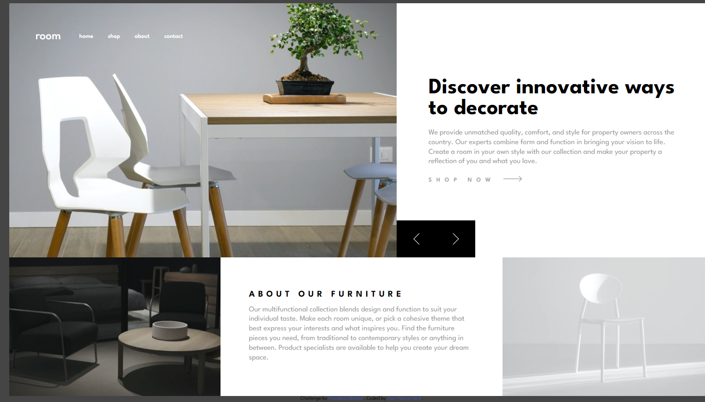

# Frontend Mentor - Room homepage solution

This is a solution to the [Room homepage challenge on Frontend Mentor](https://www.frontendmentor.io/challenges/room-homepage-BtdBY_ENq). Frontend Mentor challenges help you improve your coding skills by building realistic projects. 

 

## Table of contents

- [Overview](#overview)
 
  - [Screenshot](#screenshot)
  - [Links](#links)
 
  - [Built with](#built-with)
 
  - [Continued development](#continued-development)
 
- [Author](#Kumneger)
- [Acknowledgments](#acknowledgments)

**Note: Delete this note and update the table of contents based on what sections you keep.**

## Overview

 

### Screenshot

 

### Links

- Solution URL:  (https://kumneger49.github.io/Room-Homepage-Master/)
- Live Site URL:  (https://github.com/Kumneger49/Room-Homepage-Master)

 

### Built with

- Semantic HTML5 markup
- CSS custom properties
- Flexbox
- JS
 
### Continued development

 I wanns keep working in css layout skills and writing less js code 

 
 

## Author

- Website -  (https://kumneger49.github.io/Kumneger49/)
- Frontend Mentor -  (https://github.com/Kumneger49)
 

 

